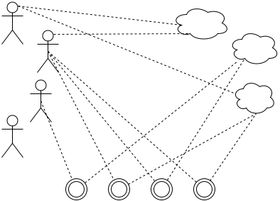
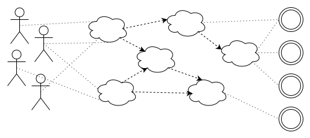
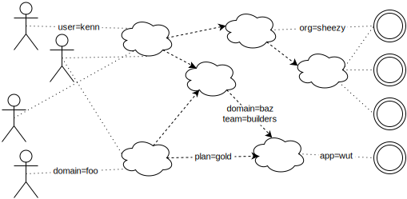

% Parameterized Role-Based Access Control
% Kenneth Knowles
% September 24, 2013

Access Control
==============

Can Kenn read `secrets.txt`?

Can ***person*** do ***action***? (on ***object***)


Formal Statements
=================

HasPermission("read", "Kenn", "secrets.txt")

`HasPermission(name="read", user="kenn", object="secrets.txt")`

...and later...

`HasPermission(name="read", params=dict(user="kenn", object="secrets.txt"))`

Unix Permissions
================

1. Users may be members of groups.
2. Files have owners and groups.
3. Files have read, write, execute bits for their owner, group, and everyone else

Directories and other stuff sort of shoehorned in.

> 


Unix Permissions Proof
======================

```
$ ls -l secrets.txt
-rwxr-----  1 root  wheel   375 Sept 10 17:47 secrets.txt
```

HasPermission("read", "kenn", "secrets.txt") ?

1. "kenn" is in group "wheel"
2. "wheel" owns "secrets.txt"
3. The "group read" bit is true.

Thus Kenn can read it.


Unix Permissions Refutation
===========================

```
$ ls -l secrets.txt
-rwxr-----  1 root  wheel   375 Sept 10 17:47 secrets.txt
```

HasPermission("read", "cory", "secrets.txt") ?

1. "cory" is not the owner.
2. "cory" is not in group "wheel".
3. The "all read" bit is false.

Thus Cory cannot read it.


Things such an inference system needs
=====================================

It needs to be fast; these things happen all the time.

It needs to be as easy to refute as to prove.

It needs to be easy to understand!


The Logic of Unix Permissions
=============================

1\. Atomic Permissions

--------------------  --------------------  --------------------
OwnerRead(_file_)     GroupRead(_file_)     AllRead(_file_)
OwnerWrite(_file_)    GroupWrite(_file_)    AllWrite(_file_)
OwnerExec(_file_)     GroupExec(_file_)     AllExec(_file_)
--------------------  --------------------  --------------------

2\. Ownership Info and Group Membership

--------------------------  --------------------------  -----------------------------
Owner(_user_, _file_)       Group(_group_, _file_)      Member(_user_, _group_)
--------------------------  --------------------------  -----------------------------

3\. Deduction Rules

 Owner(_user_, _file_) $\wedge$ OwnerRead(_file_) $\Rightarrow$ HasPermission("read", _user_, _file_)

 Member(_user_, _group_) $\wedge$ GroupRead(_file_) $\Rightarrow$ HasPermission("read", _user_, _file_)

(etc)

The Logic of Unix Permissions
=============================

Things to note:

 - Fixed set of hardcoded permissions.
 - Fixed set of deducation rules.
 - A user is zero ("all"), one ("owner"), or two ("group") degrees removed from a permisssion.

In particular, there is no interesting property of logic
leveraged. The most popular addition is transitivity.


Role-Based Access Control (RBAC)
=============================

1. Users may be members of roles
2. Roles may be contained in other Roles. 
3. Roles may be granted permissions explicitly.

> 

Role-Based Access Control Deduction
=============================

HasPermission("read", "kenn", "secrets.txt") ?

1. "kenn" is a member of "devops"
2. "devops" is contained in "secret-keepers"
3. "secret-keepers" is granted "read" on "secrets.txt"

Thus Kenn can read it.


Role-Based Access Control Refutation
=============================

HasPermission("read", "cory", "secrets.txt") ?

1. "cory" is a member of some roles ...
2. ... and those roles are member of other roles ...
3. ... but none of them grant access to "secrets.txt"

Thus Cory cannot read it.


RBAC Advantages
=============================

Permissions are abstract names, not tied to objects explicitly.

We can make roles such as "secret-keepers" that express our intent
with respect to permissions.

Separately, we can make roles such as "devops" that express intent
with respect to people.

We can then mix & match these pretty freely.

It is "easy" to query all of a users permissions, which is more or
less impossible in Unix.

It is still "easy" to query all people with a certain permission.


RBAC Disadvantages
=============================

Role relationships have to be denormalized to be fast.

Refutations are still an exhaustive search, but of a bigger thing so
it might be harder to understand.

Administration might also require a more complex UI.


The logic of RBAC 
=============================

1\. Granting permissions to roles.

> Grant(_role_, _permission_)

2\. Organizing users into roles

> Member(_user_, _role_)

3\. Setting up role containment

> Contained(_subrole_, _superrole_)


The logic of RBAC
=============================

4\. Deduction rules

Use an auxilliary HasRole(_user_, _role_)

 - Member(_user_, _role_) $\Rightarrow$ HasRole(_user_, _role_)
 - HasRole(_user_, _subrole_) $\wedge$ Contained(_subrole_, _superrole_) $\Rightarrow$ HasRole(_user_, _role_)
 - HasRole(_user_, _role_) $\wedge$ Grant(_role_, _permission_) $\Rightarrow$ HasPermission(_user_, _permission_)


The logic of RBAC
=============================

Actually, those all look pretty much the same, so if we blur our eyes...

 - Grant(_user_, _role_)
 - Grant(_role_, _role_)
 - Grant(_role_, _permission_)


The logic of RBAC
=============================

 - Grant(_subthing_, _superthing_) $\Rightarrow$ HasPermission(_subthing_, _superthing_)
 - HasPermission(_thing1_, _thing2_) $\wedge$ HasPermission(_thing2_, _thing3_) $\Rightarrow$ HasPermission(_thing1_, _thing3_)

It is just transitivity, and it is the transitivity of set containment
or (equivalently) entailment.  Each intermediate Role is just a
selected subset of of the users that have a permission. The
intermediate nodes are administrative _only_ and we can always just
summarize the graph.


The logic of RBAC
=============================

But if we look at it as entailment, and each role being a predicate then role
containment can be looked at as _custom inference rules_.

 - Contained("devops", "secret-keepers")

becomes

 - Member(_user_, "devops") $\Rightarrow$ Member(_user_, "secret-keepers")

and all the deducations come from Member, Grant, and these user-defined rules.


Parameterized Role-Based Access Control
=============================

The role "Admin" is not specific enough for Dimagi! Currently we
implicitly combine it with knowledge of what domain they are in, and
use Orgs/Teams to work around the limitation to a single domain.

Instead of "Admin" we need "Admin[_domain_]"

Take RBAC and add parameters... 

> 

Parameterized Role-Based Access Control
=============================

Now we have things like:

 - Member("kenn", Admin["dimagi"])

But also the intermediate bits can leave parameters unspecified

 - Grant(Admin[_domain_], PostForms[_domain_])

And memberships too

 - Contained(WebWorkers[_domain_], WebUsers[_domain_])

(brackets are just to reduce parentheses monotony)


The logic of PRBAC
==================

1\. Granting permissions to roles.
 
 - Grant(_role_[_roleparams_], _permission_[_permparams_])

2\. Organizing users into roles

 - Member(_user_, _role_[_roleparams_])

3\. Setting up role containment

 - Contained(_subrole_[_subparams_], _superrole_[_superparams_])


The logic of PRBAC
==================

Treating role inclusion as added inference rules now makes even more sense.

 - Contained(_subrole_[_subparams_], _superrole_[_superparams_])

becomes

 - Member(_user_, _subrole_[_subparams_]) $\Rightarrow$ Member(_user_, _superrole_[_superparams_])

And this is sort of how I think of the UI problem.  To make a role
included in another, you have to specify the parameters or say "leave
the parameter".  In the simplest case, there are no params and this UI
is simpler for the user to understand.


The Dimagi details
==================

User-defined roles:

 - Exist "in" a domain which they must always pass to any permission.

Organizations and teams:

 - A team has a particular role for a particular domain.
 - It is now really easy to define organization-level permissions, and even
   make them customizable.

Superusers:

 - Add a special value "*" that unifies with anything.


Implementing PRBAC
==================

Core objects are exactly the pieces of the logic:

 - Grant(_role_[_roleparams_], _permission_[_permparams_])
 - Member(_user_, _role_[_roleparams_])
 - Contained(_subrole_[_subparams_], _superrole_[_superparams_])

But in order for things to be fast, we need to denormalize (async) aka
deduce in advance all the consequences of transitivity.

 - Keep a full list of the permissions a user has on the user
   object. This is _not_ the "source of truth" and can be safely
   recalculated and overwritten at any time.
 - May also simply want the full list of permissions, superroles,
   subroles, and members on every node in the role graph.
